# Custom Linked Hashset

Implementation of a LinkedHashSet.

All methods implemented are identical to those found in the Java Set interface.

# Build and Test

To build and test the project run command ./gradlew clean build

# Time Complexity

| Method                                | CustomLinkedHashSet  | LinkedHashSet (JDK)  |       Winner       |
|:--------------------------------------|:--------------------:|:--------------------:|:------------------:|
| **`add(E)`**                          |        $O(1)$        |        $O(1)$        |      **Tie**       |
| **`addAll(Collection<? extends E>)`** |        $O(M)$        |        $O(M)$        |      **Tie**       |
| **`clear()`**                         |        $O(N)$        |        $O(N)$        |      **Tie**       |
| **`clone()`**                         |        $O(N)$        |        $O(N)$        |      **Tie**       |
| **`contains(Object)`**                |        $O(1)$        |        $O(1)$        |      **Tie**       |
| **`containsAll(Collection<?>)`**      |        $O(M)$        |        $O(M)$        |      **Tie**       |
| **`equals(Object)`**                  |        $O(N)$        |        $O(N)$        |      **Tie**       |
| **`hashCode()`**                      |        $O(N)$        |        $O(N)$        |      **Tie**       |
| **`isEmpty()`**                       |        $O(1)$        |        $O(1)$        |      **Tie**       |
| **`iterator()`**                      |        $O(1)$        |        $O(1)$        |      **Tie**       |
| **`remove(Object)`**                  |        $O(1)$        |        $O(1)$        |      **Tie**       |
| **`removeAll(Collection<?>)`**        |   $O(N \times M)$    |      $O(N + M)$      | **LinkedHashSet**  |
| **`retainAll(Collection<?>)`**        |   $O(N \times M)$    |   $O(N \times M)$    |      **Tie**       |
| **`size()`**                          |        $O(1)$        |        $O(1)$        |      **Tie**       |
| **`spliterator()`**                   |        $O(1)$        |        $O(1)$        |      **Tie**       |
| **`toArray()`**                       |        $O(N)$        |        $O(N)$        |      **Tie**       |
| **`toArray(T[])`**                    |        $O(N)$        |        $O(N)$        |      **Tie**       |
| **`toString()`**                      |        $O(N)$        |        $O(N)$        |      **Tie**       |

# Space Complexity

| Method                                | CustomLinkedHashSet  | LinkedHashSet (JDK)  |  Winner  |
|:--------------------------------------|:--------------------:|:--------------------:|:--------:|
| **`add(E)`**                          |        $O(1)$        |        $O(1)$        | **Tie**  |
| **`addAll(Collection<? extends E>)`** |        $O(1)$        |        $O(1)$        | **Tie**  |
| **`clear()`**                         |        $O(1)$        |        $O(1)$        | **Tie**  |
| **`clone()`**                         |        $O(N)$        |        $O(N)$        | **Tie**  |
| **`contains(Object)`**                |        $O(1)$        |        $O(1)$        | **Tie**  |
| **`containsAll(Collection<?>)`**      |        $O(1)$        |        $O(1)$        | **Tie**  |
| **`equals(Object)`**                  |        $O(1)$        |        $O(1)$        | **Tie**  |
| **`hashCode()`**                      |        $O(1)$        |        $O(1)$        | **Tie**  |
| **`isEmpty()`**                       |        $O(1)$        |        $O(1)$        | **Tie**  |
| **`iterator()`**                      |        $O(1)$        |        $O(1)$        | **Tie**  |
| **`remove(Object)`**                  |        $O(1)$        |        $O(1)$        | **Tie**  |
| **`removeAll(Collection<?>)`**        |        $O(1)$        |        $O(1)$        | **Tie**  |
| **`retainAll(Collection<?>)`**        |        $O(1)$        |        $O(1)$        | **Tie**  |
| **`size()`**                          |        $O(1)$        |        $O(1)$        | **Tie**  |
| **`spliterator()`**                   |        $O(1)$        |        $O(1)$        | **Tie**  |
| **`toArray()`**                       |        $O(N)$        |        $O(N)$        | **Tie**  |
| **`toArray(T[])`**                    |        $O(N)$        |        $O(N)$        | **Tie**  |
| **`toString()`**                      |        $O(N)$        |        $O(N)$        | **Tie**  |

**Notes**:
- n: Total number of elements currently stored within the set.
- m: Number of elements in the incoming collection argument.

# Performance Charts

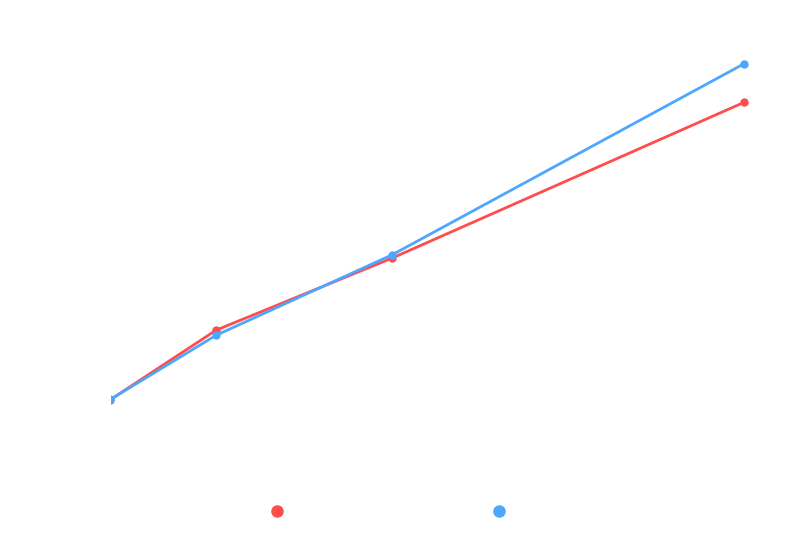
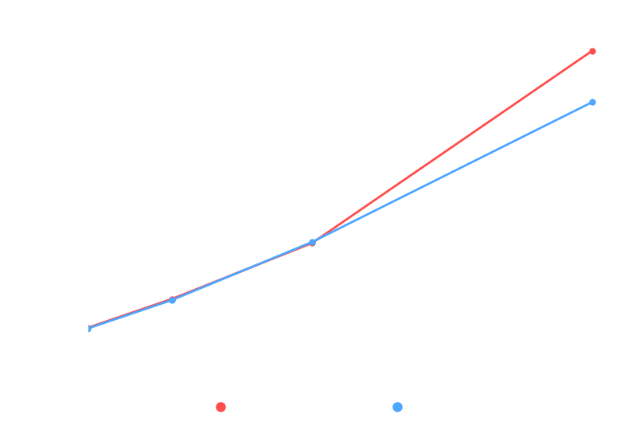
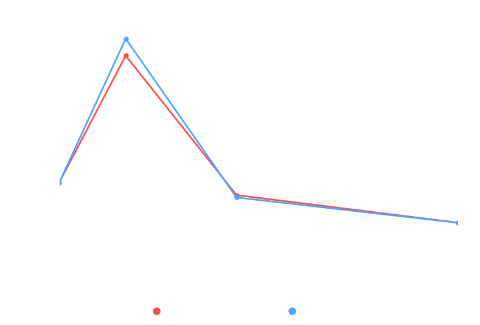
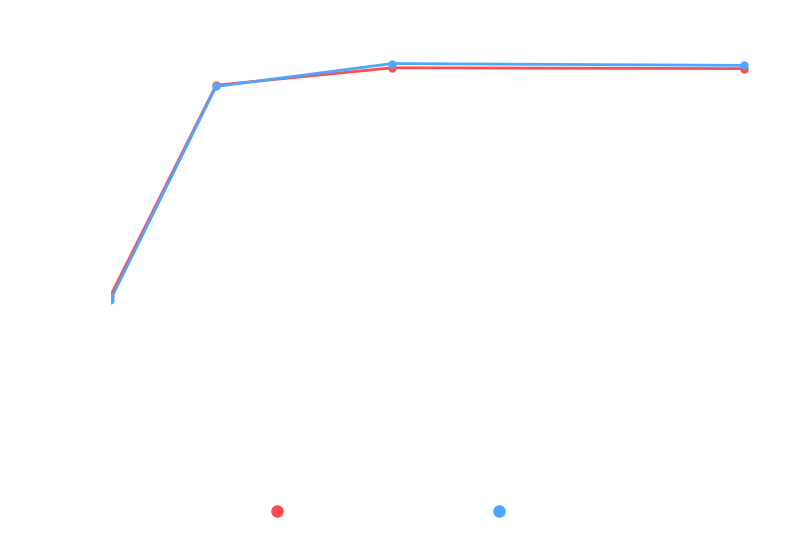
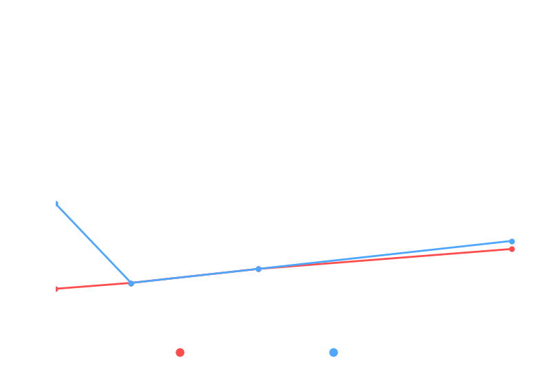
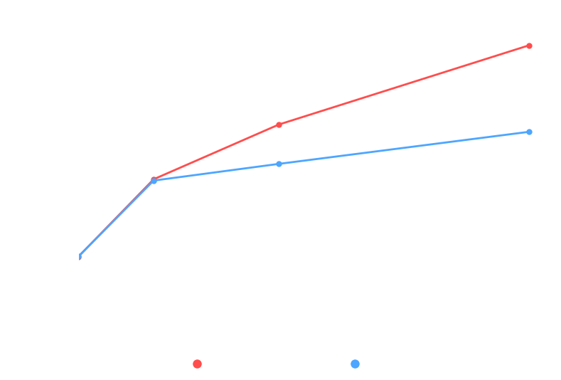
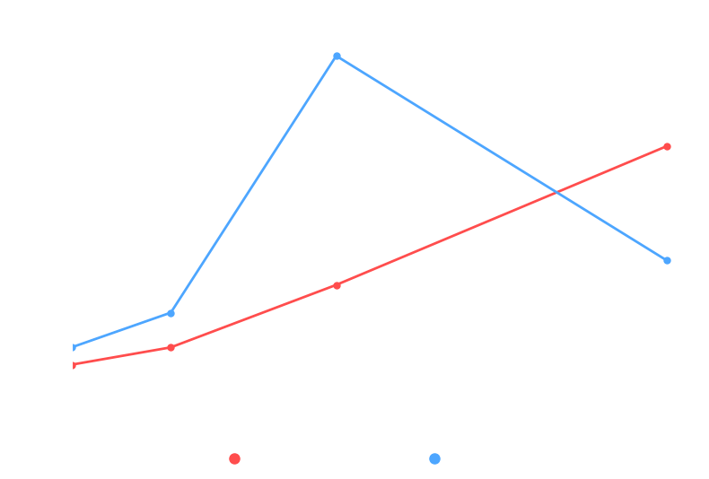
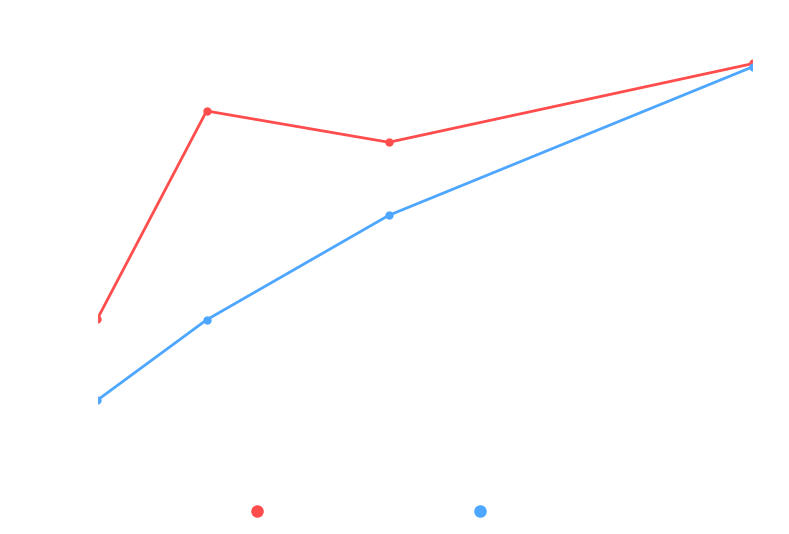
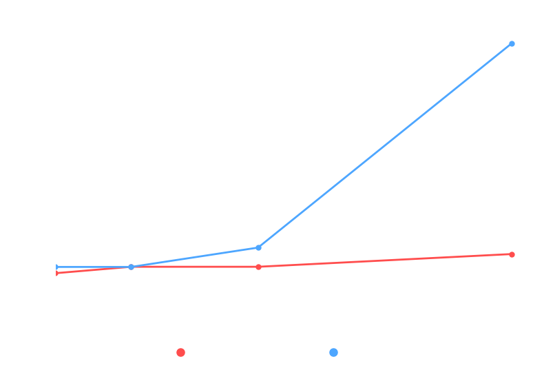
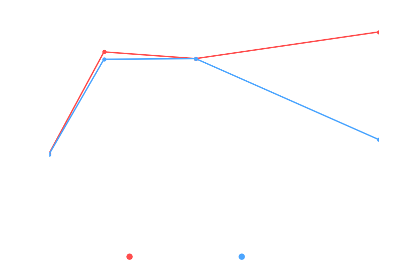
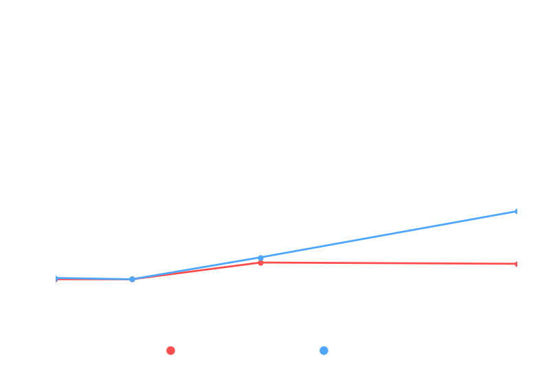

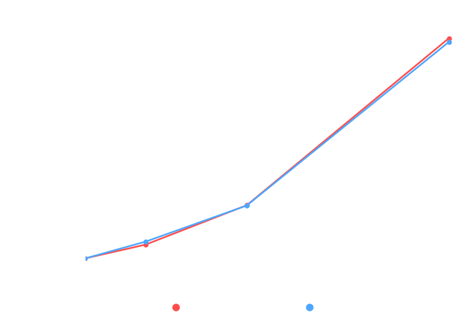
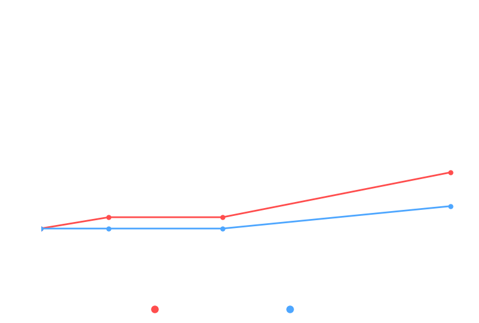
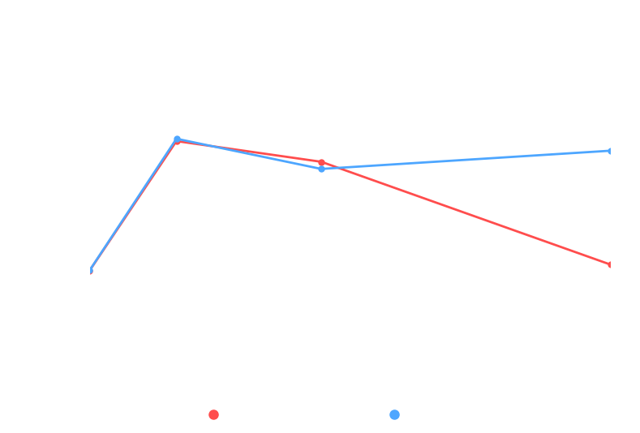
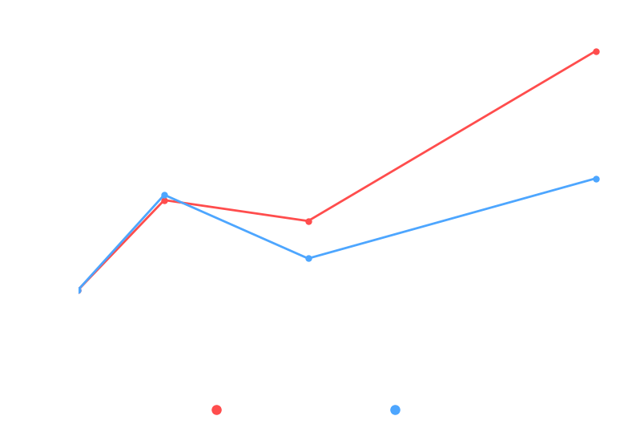
![toArray(T[])(Collection).png](PerformanceCharts/plot_toArray_T[]_.png)
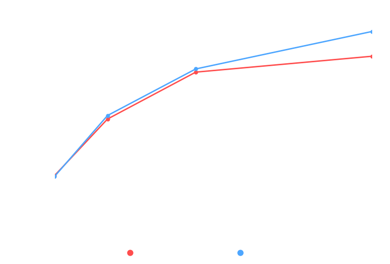