# Custom Linked Hashset

Implementation of a LinkedHashSet.

All methods implemented are identical to those found in the Java Set interface.

# Build and Test

To build and test the project run command `./gradlew clean build`

# Time Complexity

| Method                                |     Custom      |        JDK        | Winner  |
|:--------------------------------------|:---------------:|:-----------------:|:-------:|
| **`add(E)`**                          |     $O(1)$      |      $O(1)$       | **Tie** |
| **`addAll(Collection<? extends E>)`** |     $O(M)$      |      $O(M)$       | **Tie** |
| **`clear()`**                         |     $O(N)$      |      $O(N)$       | **Tie** |
| **`clone()`**                         |     $O(N)$      |      $O(N)$       | **Tie** |
| **`contains(Object)`**                |     $O(1)$      |      $O(1)$       | **Tie** |
| **`containsAll(Collection<?>)`**      |     $O(M)$      |      $O(M)$       | **Tie** |
| **`equals(Object)`**                  |     $O(N)$      |      $O(N)$       | **Tie** |
| **`hashCode()`**                      |     $O(N)$      |      $O(N)$       | **Tie** |
| **`isEmpty()`**                       |     $O(1)$      |      $O(1)$       | **Tie** |
| **`iterator()`**                      |     $O(1)$      |      $O(1)$       | **Tie** |
| **`remove(Object)`**                  |     $O(1)$      |      $O(1)$       | **Tie** |
| **`removeAll(Collection<?>)`**        | $O(N \times M)$ |  $O(N \times M)$  | **Tie** |
| **`retainAll(Collection<?>)`**        | $O(N \times M)$ |  $O(N \times M)$  | **Tie** |
| **`size()`**                          |     $O(1)$      |      $O(1)$       | **Tie** |
| **`spliterator()`**                   |     $O(1)$      |      $O(1)$       | **Tie** |
| **`toArray()`**                       |     $O(N)$      |      $O(N)$       | **Tie** |
| **`toArray(T[])`**                    |     $O(N)$      |      $O(N)$       | **Tie** |
| **`toString()`**                      |     $O(N)$      |      $O(N)$       | **Tie** |

# Space Complexity

| Method                                | Custom |  JDK   |  Winner  |
|:--------------------------------------|:------:|:------:|:--------:|
| **`add(E)`**                          | $O(1)$ | $O(1)$ | **Tie**  |
| **`addAll(Collection<? extends E>)`** | $O(1)$ | $O(1)$ | **Tie**  |
| **`clear()`**                         | $O(1)$ | $O(1)$ | **Tie**  |
| **`clone()`**                         | $O(N)$ | $O(N)$ | **Tie**  |
| **`contains(Object)`**                | $O(1)$ | $O(1)$ | **Tie**  |
| **`containsAll(Collection<?>)`**      | $O(1)$ | $O(1)$ | **Tie**  |
| **`equals(Object)`**                  | $O(1)$ | $O(1)$ | **Tie**  |
| **`hashCode()`**                      | $O(1)$ | $O(1)$ | **Tie**  |
| **`isEmpty()`**                       | $O(1)$ | $O(1)$ | **Tie**  |
| **`iterator()`**                      | $O(1)$ | $O(1)$ | **Tie**  |
| **`remove(Object)`**                  | $O(1)$ | $O(1)$ | **Tie**  |
| **`removeAll(Collection<?>)`**        | $O(1)$ | $O(1)$ | **Tie**  |
| **`retainAll(Collection<?>)`**        | $O(1)$ | $O(1)$ | **Tie**  |
| **`size()`**                          | $O(1)$ | $O(1)$ | **Tie**  |
| **`spliterator()`**                   | $O(1)$ | $O(1)$ | **Tie**  |
| **`toArray()`**                       | $O(N)$ | $O(N)$ | **Tie**  |
| **`toArray(T[])`**                    | $O(N)$ | $O(N)$ | **Tie**  |
| **`toString()`**                      | $O(N)$ | $O(N)$ | **Tie**  |

**Notes**:
- n: Total number of elements currently stored within the set.
- m: Number of elements in the incoming collection argument.

# Performance Comparison

| Method                            | Custom Avg (ns) | JDK Avg (ns)  |            Winner            | Margin |
|:----------------------------------|:----------------|:--------------|:----------------------------:|:------:|
| `Constructor()`                   | 60              | 85            |          **Custom**          | 1.43x  |
| `Constructor(Collection)`         | 889,714         | 1,332,410     |          **Custom**          | 1.50x  |
| `Constructor(int)`                | 90              | 205           |          **Custom**          | 2.27x  |
| `Constructor(int, float)`         | 70              | 109           |          **Custom**          | 1.55x  |
| `add(E)`                          | 2,096,563       | 2,120,029     | **Statistically Equivalent** | 1.01x  |
| `addAll(Collection<? extends E>)` | 825,988         | 857,148       | **Statistically Equivalent** | 1.04x  |
| `clear()`                         | 27,707          | 44,376        |          **Custom**          | 1.60x  |
| `clone()`                         | 820,906         | 1,287,559     |          **Custom**          | 1.57x  |
| `contains(Object)`                | 115             | 227           |          **Custom**          | 1.98x  |
| `containsAll(Collection<?>)`      | 501,230         | 850,807       |          **Custom**          | 1.70x  |
| `equals(Object)`                  | 559,604         | 996,686       |          **Custom**          | 1.78x  |
| `hashCode()`                      | 131,695         | 234,715       |          **Custom**          | 1.78x  |
| `isEmpty()`                       | 42              | 67            |          **Custom**          | 1.61x  |
| `iterator()`                      | 114,376         | 238,337       |          **Custom**          | 2.08x  |
| `remove(Object)`                  | 168             | 679           |          **Custom**          | 4.04x  |
| `removeAll(Collection<?>)`        | 1,043,358,311   | 1,819,780,036 |          **Custom**          | 1.74x  |
| `retainAll(Collection<?>)`        | 1,042,457,650   | 1,825,860,116 |          **Custom**          | 1.75x  |
| `size()`                          | 37              | 52            |          **Custom**          | 1.40x  |
| `spliterator()`                   | 131,350         | 219,133       |          **Custom**          | 1.67x  |
| `toArray()`                       | 78,326          | 133,753       |          **Custom**          | 1.71x  |
| `toArray(T[])`                    | 93,016          | 161,971       |          **Custom**          | 1.74x  |
| `toString()`                      | 1,817,993       | 2,612,949     |          **Custom**          | 1.44x  |

# Performance Charts

#### Note: The following performance charts are designed to be viewed in dark mode.
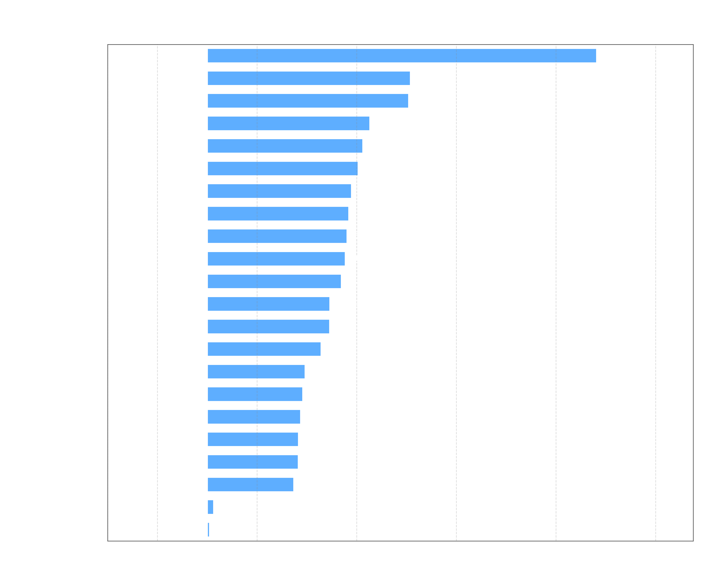

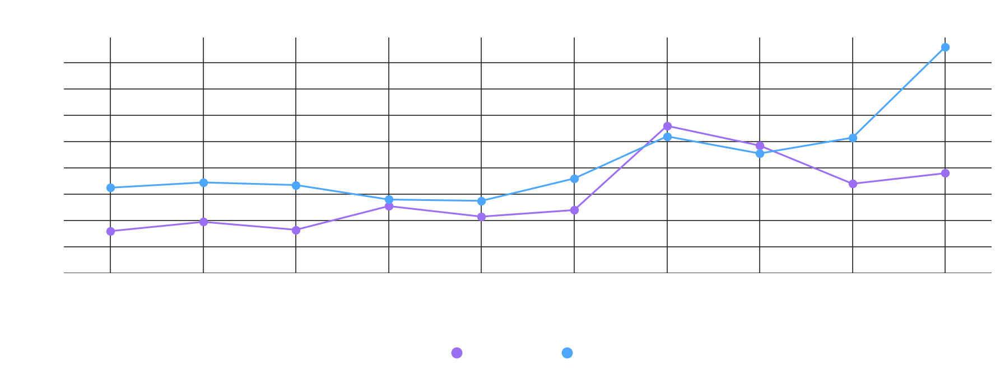
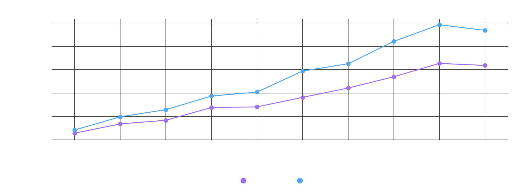
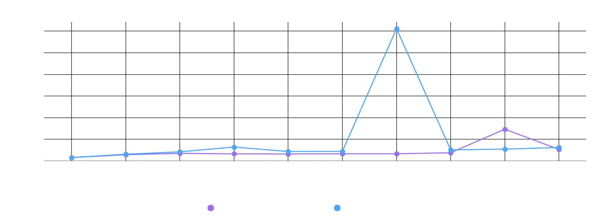
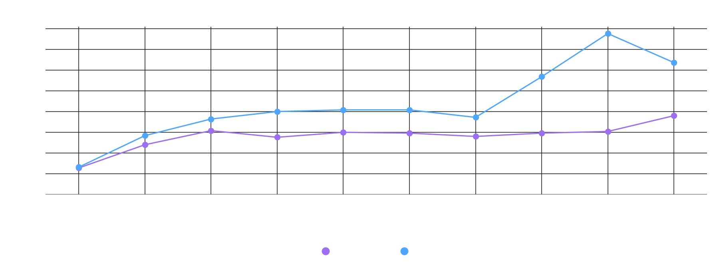
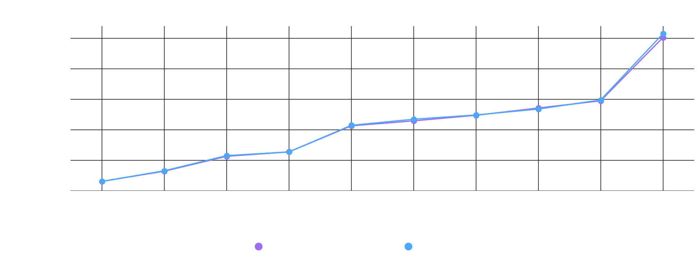
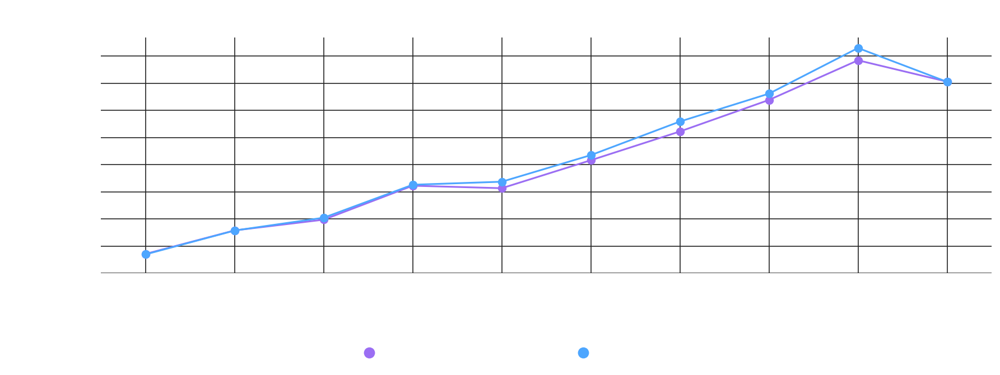
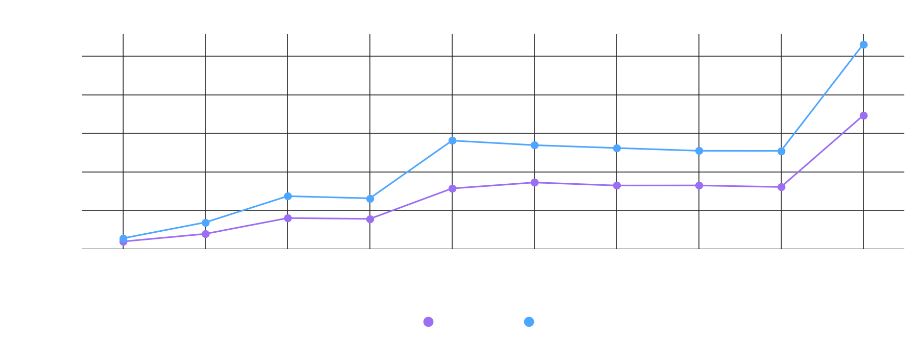
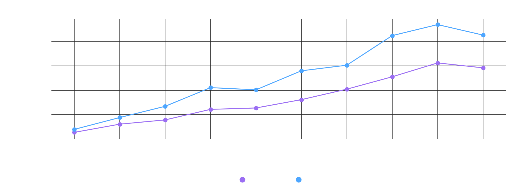
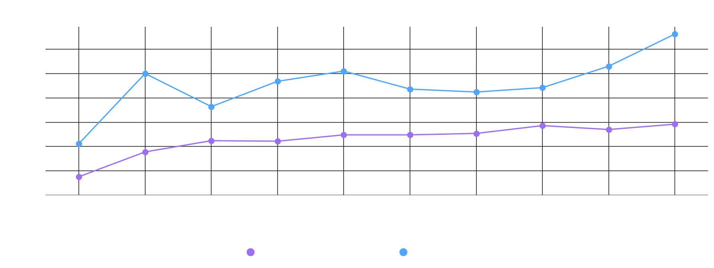
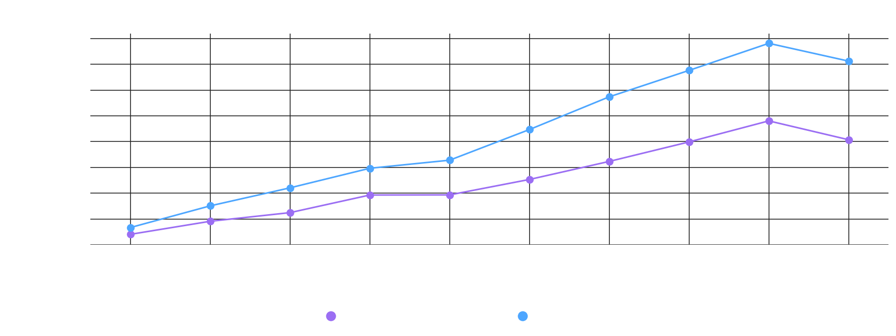
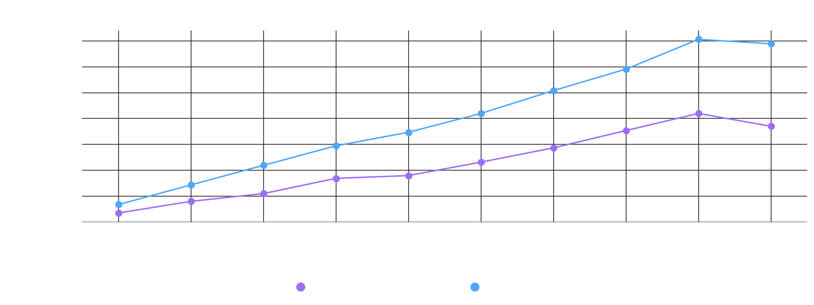
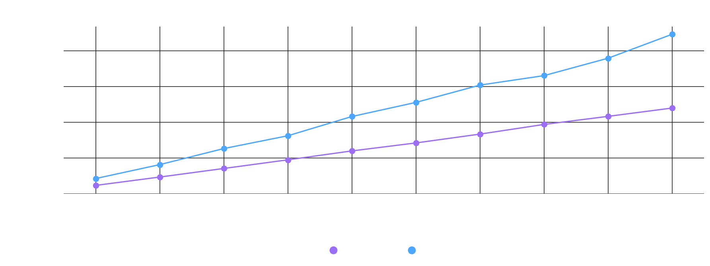
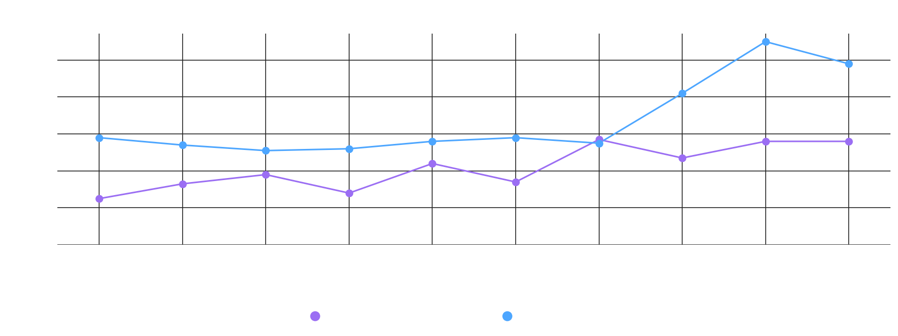
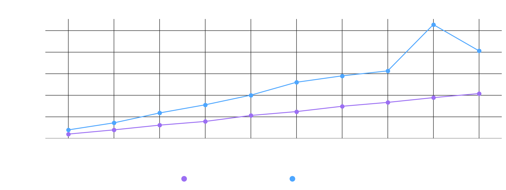
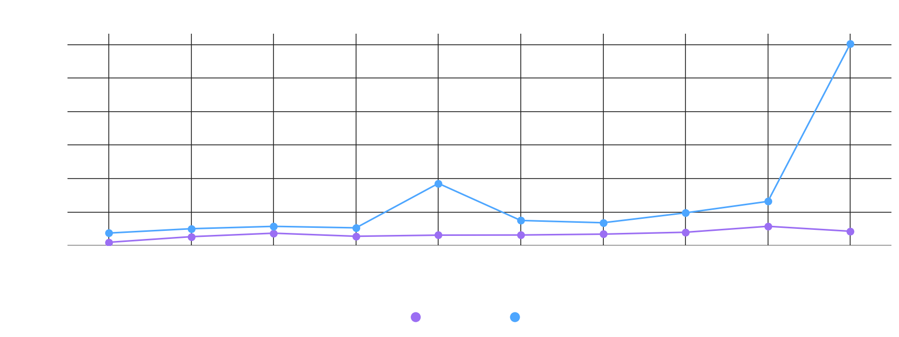
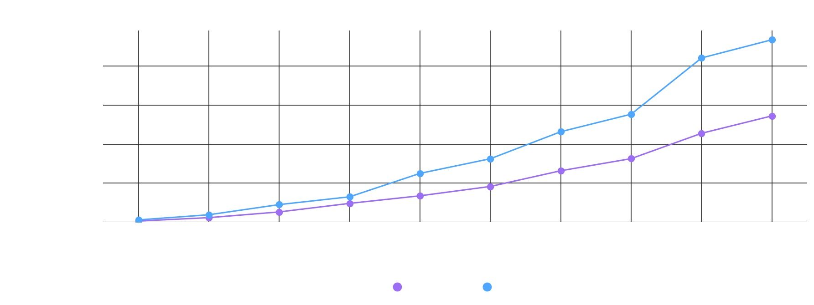
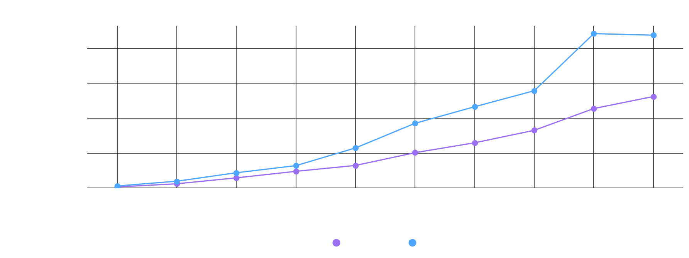
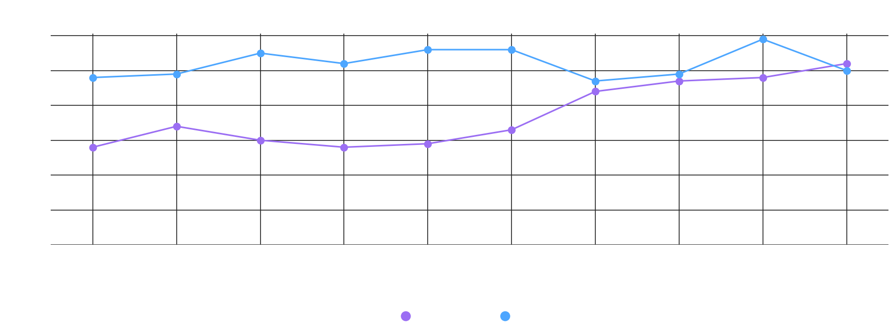
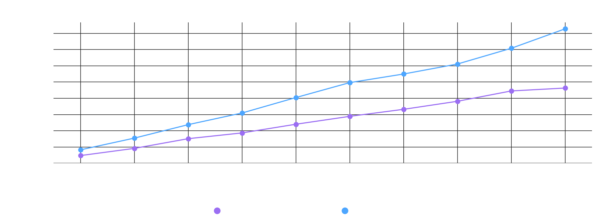
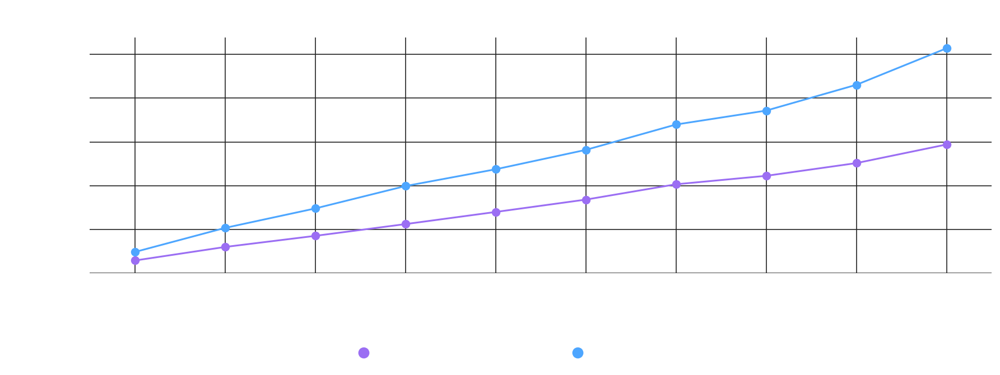
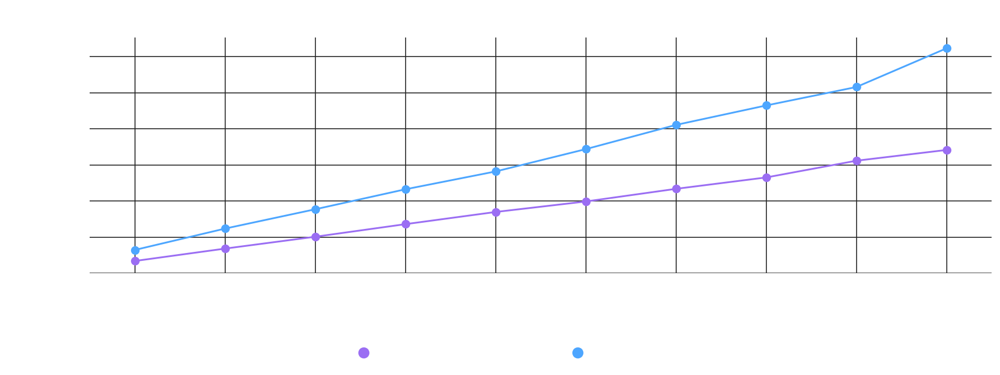
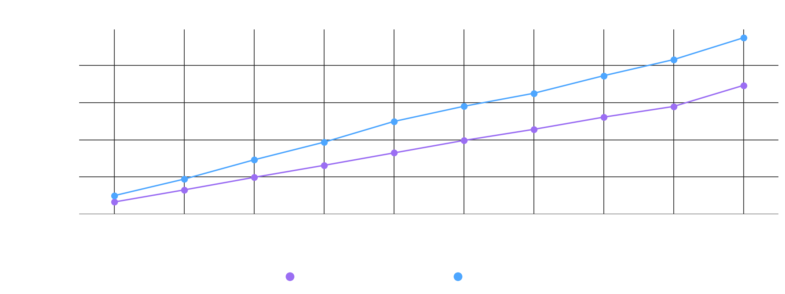