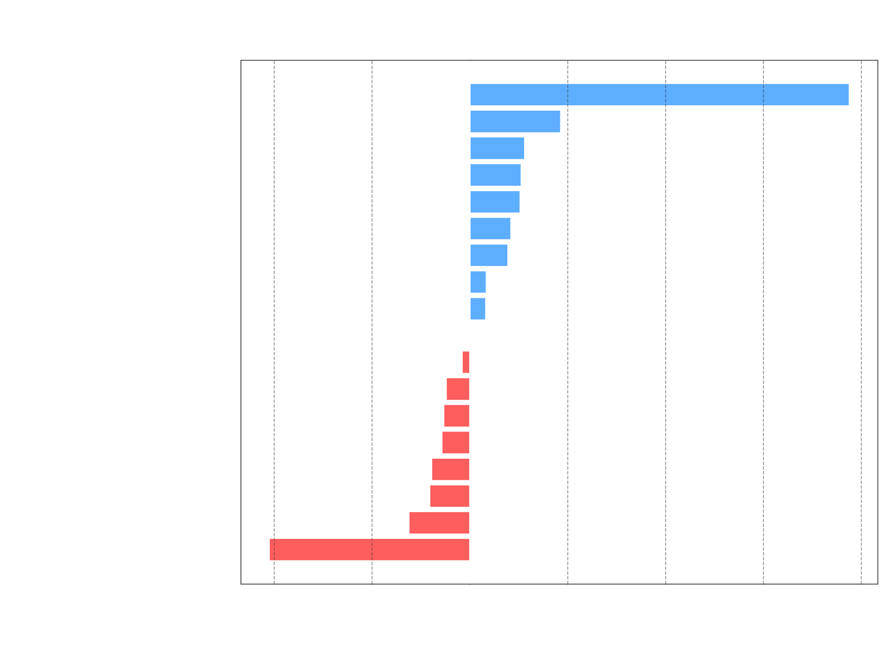
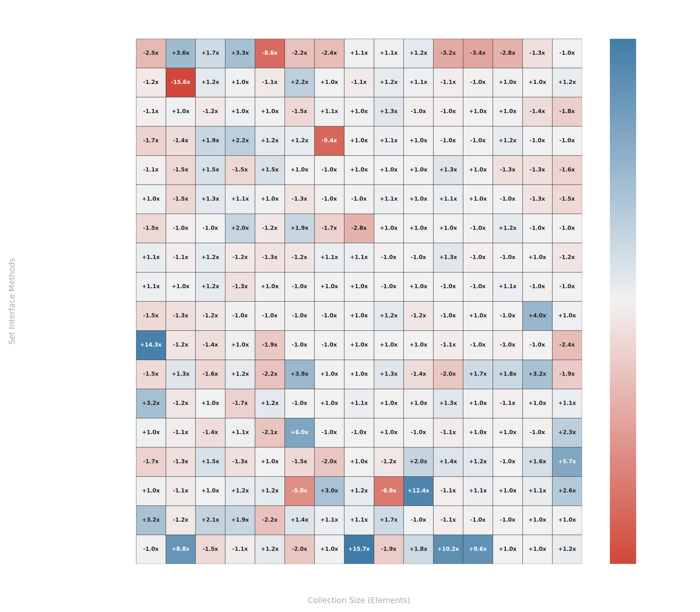
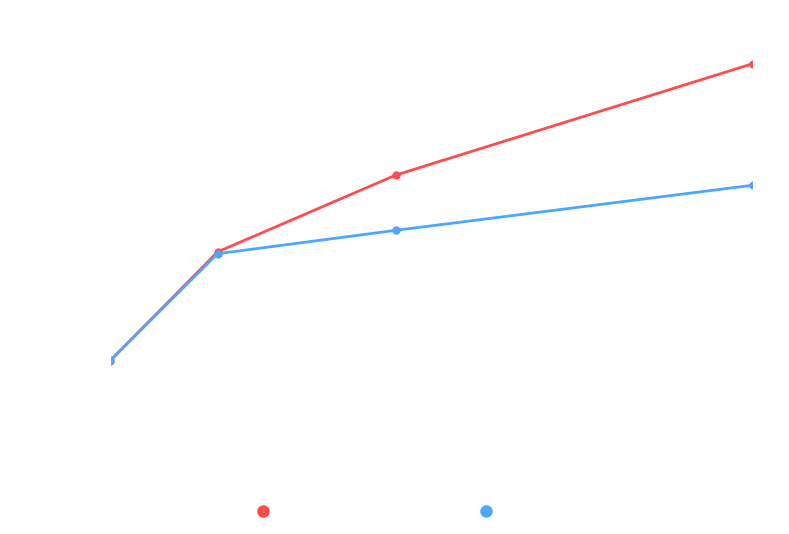
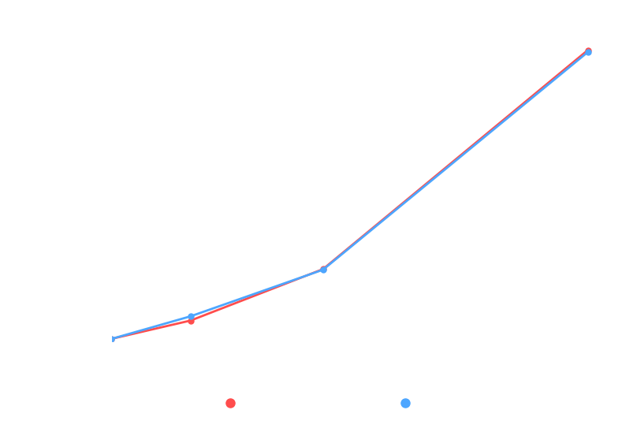

# Custom Linked Hashset

Implementation of a LinkedHashSet.

All methods implemented are identical to those found in the Java Set interface.

# Build and Test

To build and test the project run command ./gradlew clean build

# Time Complexity

| Method                                | CustomLinkedHashSet | LinkedHashSet (JDK) | Winner  |
|:--------------------------------------|:-------------------:|:-------------------:|:-------:|
| **`add(E)`**                          |       $O(1)$        |       $O(1)$        | **Tie** |
| **`addAll(Collection<? extends E>)`** |       $O(M)$        |       $O(M)$        | **Tie** |
| **`clear()`**                         |       $O(N)$        |       $O(N)$        | **Tie** |
| **`clone()`**                         |       $O(N)$        |       $O(N)$        | **Tie** |
| **`contains(Object)`**                |       $O(1)$        |       $O(1)$        | **Tie** |
| **`containsAll(Collection<?>)`**      |       $O(M)$        |       $O(M)$        | **Tie** |
| **`equals(Object)`**                  |       $O(N)$        |       $O(N)$        | **Tie** |
| **`hashCode()`**                      |       $O(N)$        |       $O(N)$        | **Tie** |
| **`isEmpty()`**                       |       $O(1)$        |       $O(1)$        | **Tie** |
| **`iterator()`**                      |       $O(1)$        |       $O(1)$        | **Tie** |
| **`remove(Object)`**                  |       $O(1)$        |       $O(1)$        | **Tie** |
| **`removeAll(Collection<?>)`**        |   $O(N \times M)$   |   $O(N \times M)$   | **Tie** |
| **`retainAll(Collection<?>)`**        |   $O(N \times M)$   |   $O(N \times M)$   | **Tie** |
| **`size()`**                          |       $O(1)$        |       $O(1)$        | **Tie** |
| **`spliterator()`**                   |       $O(1)$        |       $O(1)$        | **Tie** |
| **`toArray()`**                       |       $O(N)$        |       $O(N)$        | **Tie** |
| **`toArray(T[])`**                    |       $O(N)$        |       $O(N)$        | **Tie** |
| **`toString()`**                      |       $O(N)$        |       $O(N)$        | **Tie** |

# Space Complexity

| Method                                | CustomLinkedHashSet  | LinkedHashSet (JDK)  |  Winner  |
|:--------------------------------------|:--------------------:|:--------------------:|:--------:|
| **`add(E)`**                          |        $O(1)$        |        $O(1)$        | **Tie**  |
| **`addAll(Collection<? extends E>)`** |        $O(1)$        |        $O(1)$        | **Tie**  |
| **`clear()`**                         |        $O(1)$        |        $O(1)$        | **Tie**  |
| **`clone()`**                         |        $O(N)$        |        $O(N)$        | **Tie**  |
| **`contains(Object)`**                |        $O(1)$        |        $O(1)$        | **Tie**  |
| **`containsAll(Collection<?>)`**      |        $O(1)$        |        $O(1)$        | **Tie**  |
| **`equals(Object)`**                  |        $O(1)$        |        $O(1)$        | **Tie**  |
| **`hashCode()`**                      |        $O(1)$        |        $O(1)$        | **Tie**  |
| **`isEmpty()`**                       |        $O(1)$        |        $O(1)$        | **Tie**  |
| **`iterator()`**                      |        $O(1)$        |        $O(1)$        | **Tie**  |
| **`remove(Object)`**                  |        $O(1)$        |        $O(1)$        | **Tie**  |
| **`removeAll(Collection<?>)`**        |        $O(1)$        |        $O(1)$        | **Tie**  |
| **`retainAll(Collection<?>)`**        |        $O(1)$        |        $O(1)$        | **Tie**  |
| **`size()`**                          |        $O(1)$        |        $O(1)$        | **Tie**  |
| **`spliterator()`**                   |        $O(1)$        |        $O(1)$        | **Tie**  |
| **`toArray()`**                       |        $O(N)$        |        $O(N)$        | **Tie**  |
| **`toArray(T[])`**                    |        $O(N)$        |        $O(N)$        | **Tie**  |
| **`toString()`**                      |        $O(N)$        |        $O(N)$        | **Tie**  |

**Notes**:
- n: Total number of elements currently stored within the set.
- m: Number of elements in the incoming collection argument.

# Performance Comparison

| Method                            | Custom Avg (ns) | JDK Avg (ns) | Winner                   | Margin  |
|:----------------------------------|:----------------|:-------------|:-------------------------|:-------:|
| `add(E)`                          | 920,394         | 982,142      | **Custom**               |  1.07x  |
| `addAll(Collection<? extends E>)` | 774,436         | 703,908      | **LinkedHashSet (JDK)**  |  1.10x  |
| `clear()`                         | 58,514          | 59,814       | Statistically Equivalent |  1.02x  |
| `clone()`                         | 625,292         | 634,914      | Statistically Equivalent |  1.02x  |
| `contains(Object)`                | 1,528           | 2,320        | **Custom**               |  1.52x  |
| `containsAll(Collection<?>)`      | 385,430         | 320,733      | **LinkedHashSet (JDK)**  |  1.20x  |
| `equals(Object)`                  | 883             | 1,011        | **Custom**               |  1.14x  |
| `hashCode()`                      | 65,536          | 43,978       | **LinkedHashSet (JDK)**  |  1.49x  |
| `isEmpty()`                       | 245             | 317          | **Custom**               |  1.30x  |
| `iterator()`                      | 196,114         | 162,694      | **LinkedHashSet (JDK)**  |  1.21x  |
| `remove(Object)`                  | 2,095           | 2,228        | **Custom**               |  1.06x  |
| `removeAll(Collection<?>)`        | 206,660,483     | 207,504,914  | Statistically Equivalent |  1.00x  |
| `retainAll(Collection<?>)`        | 205,324,258     | 204,576,608  | Statistically Equivalent |  1.00x  |
| `size()`                          | 192             | 178          | **LinkedHashSet (JDK)**  |  1.08x  |
| `spliterator()`                   | 298,469         | 338,072      | **Custom**               |  1.13x  |
| `toArray()`                       | 114,767         | 90,039       | **LinkedHashSet (JDK)**  |  1.27x  |
| `toArray(T[])`                    | 134,467         | 174,839      | **Custom**               |  1.30x  |
| `toString()`                      | 877,125         | 911,203      | Statistically Equivalent |  1.04x  |

| Method                            | Overall Trend (Geo-mean) | Small-Scale Tier (≤100)   | Large-Scale Tier (≥10k)   |
|:----------------------------------|:-------------------------|:--------------------------|:--------------------------|
| `add(E)`                          | Custom (1.08x)           | JDK (1.25x)               | Custom (1.06x)            |
| `addAll(Collection<? extends E>)` | Tie (1.01x)              | Tie (1.03x)               | JDK (1.13x)               |
| `clear()`                         | Tie (1.00x)              | Tie (1.05x)               | Tie (1.04x)               |
| `clone()`                         | Custom (1.18x)           | Custom (1.32x)            | Tie (1.00x)               |
| `contains(Object)`                | Custom (1.77x)           | Custom (1.40x)            | Custom (1.89x)            |
| `containsAll(Collection<?>)`      | JDK (1.05x)              | Tie (1.04x)               | JDK (1.25x)               |
| `equals(Object)`                  | Custom (1.08x)           | JDK (1.20x)               | Custom (1.40x)            |
| `hashCode()`                      | JDK (1.41x)              | Custom (1.92x)            | JDK (1.50x)               |
| `isEmpty()`                       | Custom (1.10x)           | JDK (1.45x)               | Custom (2.75x)            |
| `iterator()`                      | Tie (1.03x)              | Custom (2.47x)            | JDK (1.25x)               |
| `remove(Object)`                  | Custom (1.11x)           | Tie (1.03x)               | Custom (1.57x)            |
| `removeAll(Collection<?>)`        | Tie (1.05x)              | Custom (1.53x)            | Tie (1.00x)               |
| `retainAll(Collection<?>)`        | JDK (1.08x)              | Custom (2.03x)            | Tie (1.00x)               |
| `size()`                          | JDK (1.06x)              | JDK (1.08x)               | JDK (1.36x)               |
| `spliterator()`                   | Custom (1.10x)           | Tie (1.05x)               | Custom (1.19x)            |
| `toArray()`                       | JDK (1.08x)              | Tie (1.03x)               | JDK (1.34x)               |
| `toArray(T[])`                    | Tie (1.03x)              | JDK (1.24x)               | Custom (1.35x)            |
| `toString()`                      | JDK (1.12x)              | JDK (2.56x)               | Custom (1.07x)            |

# Performance Charts

#### Note: The following performance charts are designed to be viewed in dark mode.

![toArray(T[])(Collection).png](PerformanceCharts/plot_toArray_T[]_.png)
